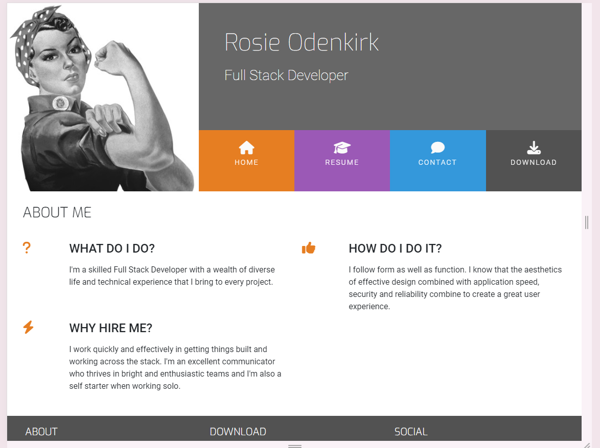
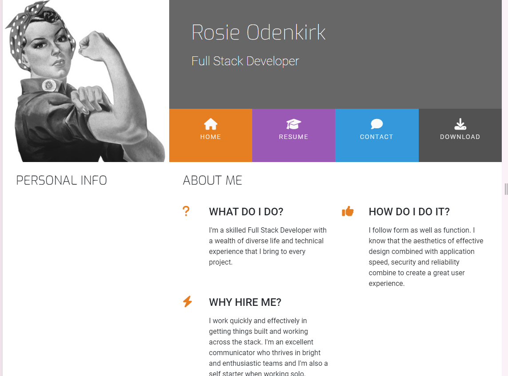

**Love Rosie**
A mini project with Bootstrap 4. From Code Institute 16 week Full Stack Bootcamp.  
Created with the older Bootstrap 4 documentation, which you can find here: www.getbootstrap.com/docs/4.6/getting-started/introduction/

**This is my first ever README.**
I'm using the following resources to guide me. 
https://www.makeareadme.com/
https://github.com/matiassingers/awesome-readme

**Description**
Let people know what your project can do specifically. Provide context and add a link to any reference visitors might be unfamiliar with. A list of Features or a Background subsection can also be added here. If there are alternatives to your project, this is a good place to list differentiating factors.

**Please Note**, this project is part of my learning with Code Institute. 
Bootstrap recently released their newest version: Bootstrap 5. This means that the standard getbootstrap.com link now defaults to the newest version, which includes updated links, scripts and classes that will not work when following along with this video series.

**Resources**
The Bootstrap Github Repository can be accessed here: github.com/twbs/bootstrap

hover.css version
In order to get the same output as the instructor in this video, your version of hover.css must be the same. Please use the following link to install hover.css into this project:
<link rel="stylesheet" href="https://cdnjs.cloudflare.com/ajax/libs/hover.css/2.1.1/css/hover-min.css" type="text/css" />

**Current Issues / Questions**
Adding menu items. Here we add a class of no-gutters to the col div's, to tidy up the spaces in the menu items. This would be helpful for previous project I got stuck on, but we didn't add the no-gutters into our .css, so it must just be one of things to know?
I think this is because it's part of the hidden .css styles we added using bootstrap; these can all be seen/identified in Chrome devtools. 

Is it still necessary to add the aria-hidden="true" to hide from screen readers? The current fontawesome icons copy paste function doesn't include that... 

**Resolved issues**
Some of the issues I have encoutered were

Google fonts is used in a different way now to when the video was compiled. Check (https://fonts.google.com/) for details and tutorials. 

Font Awesome https://fontawesome.com/ has also been updated , and icons are added in a different way.

I chose to complete the project using new code from those sites, rather than copy-paste the older info. 

Do want to know about issues that took me ages to resolve, things like having a rogue </a> in the middle of a line of html that excluded the line from a class for styling? I use diffchecker to check the source code if I can't work it out myself, but I'm increasingly finding that the source code is not always correct and sometimes completely changes from one video to the next!   

**Things I love about this project**
I **Love** the hover sweep to bottom class effect here

**Badges**
On some READMEs, you may see small images that convey metadata, such as whether or not all the tests are passing for the project. You can use Shields to add some to your README. Many services also have instructions for adding a badge.

**Visuals**
Depending on what you are making, it can be a good idea to include screenshots or even a video (you'll frequently see GIFs rather than actual videos). Tools like ttygif can help, but check out Asciinema for a more sophisticated method.

**Installation**
Within a particular ecosystem, there may be a common way of installing things, such as using Yarn, NuGet, or Homebrew. However, consider the possibility that whoever is reading your README is a novice and would like more guidance. Listing specific steps helps remove ambiguity and gets people to using your project as quickly as possible. If it only runs in a specific context like a particular programming language version or operating system or has dependencies that have to be installed manually, also add a Requirements subsection.

**Usage**
Use examples liberally, and show the expected output if you can. It's helpful to have inline the smallest example of usage that you can demonstrate, while providing links to more sophisticated examples if they are too long to reasonably include in the README.

**Support**
Tell people where they can go to for help. It can be any combination of an issue tracker, a chat room, an email address, etc.
I'm a freelancer so you'kk often find my in front of my scree. Message me here (https://github.com/LJTalks/UCD-Resume) and I'll be in touch!

**Roadmap**
If you have ideas for releases in the future, it is a good idea to list them in the README.

**Contributing**
State if you are open to contributions and what your requirements are for accepting them.

For people who want to make changes to your project, it's helpful to have some documentation on how to get started. Perhaps there is a script that they should run or some environment variables that they need to set. Make these steps explicit. These instructions could also be useful to your future self.

You can also document commands to lint the code or run tests. These steps help to ensure high code quality and reduce the likelihood that the changes inadvertently break something. Having instructions for running tests is especially helpful if it requires external setup, such as starting a Selenium server for testing in a browser.

**Authors and acknowledgment**
Show your appreciation to those who have contributed to the project.

**License**
For open source projects, say how it is licensed.

**Project status**
If you have run out of energy or time for your project, put a note at the top of the README saying that development has slowed down or stopped completely. Someone may choose to fork your project or volunteer to step in as a maintainer or owner, allowing your project to keep going. You can also make an explicit request for maintainers.