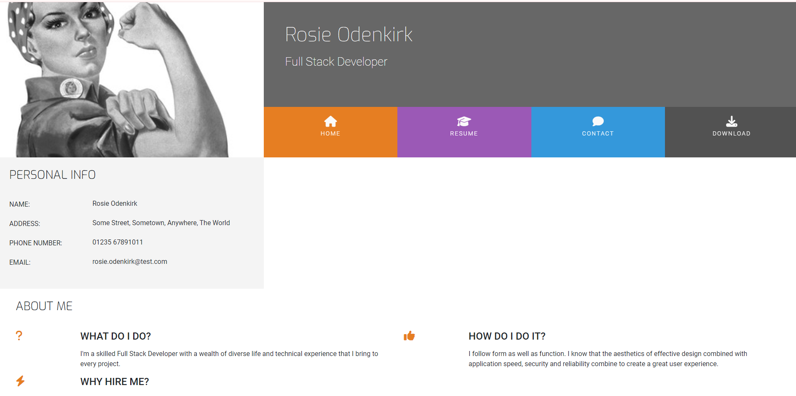

# Love Rosie

A mini project built with Bootstrap 4 as part of the Code Institute's 16-week Full Stack Bootcamp. This project utilizes Bootstrap 4 documentation, which you can find [here](https://getbootstrap.com/docs/4.2/getting-started/introduction/).

## Overview

**Love Rosie** is a personal project to showcase the application of Bootstrap 4 in creating responsive and interactive web pages. This project demonstrates the use of Bootstrap components and utilities to build a resume and portfolio website.

## Features

- **Responsive Layout**: Ensures the website looks great on all devices.
- **Interactive Elements**: Uses Bootstrap's interactive components like modals and carousels.
- **Custom Styles**: Integrates custom CSS for personalized design touches.
- **Contact Form**: A functional contact form to gather user inquiries.
- **Downloadable Resume**: Provides an option to download a PDF version of the resume.

## Technologies Used

- **HTML**: For structuring the content.
- **CSS**: For styling the content.
- **JavaScript**: For adding interactive behavior.
- **Bootstrap 4**: For responsive design and pre-built components.
- **GitHub Pages**: For hosting the live site.

## Live Site

Check out the live site: [Love Rosie Bootstrap 4 Project](https://ljtalks.github.io/UCD-Resume/)

## Known Issues

The website may not display correctly on older browsers.
Responsiveness issues on certain devices.

## Troubleshooting
Issue: Website not loading properly.
Solution: Ensure you are connected to the internet and GitHub Pages is up.

## Resolved Issues
Contact Details Display: Initially, the "About Me" section spanned only 2/3 of the page.

Resolution: Removed the row class as suggested in a follow-up video, fixing the layout.

Column Layout Issue: Persistent column misalignment due to missing or extra div tags.

Resolution: Identified and corrected misplaced div tags with the help of W3 Validator, diffchecker and Student Support.

## Contact
For any inquiries, please contact:

https://github.com/LJTalks/UCD-Resume